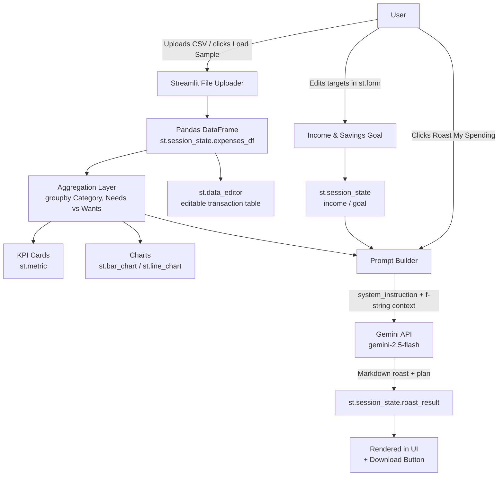
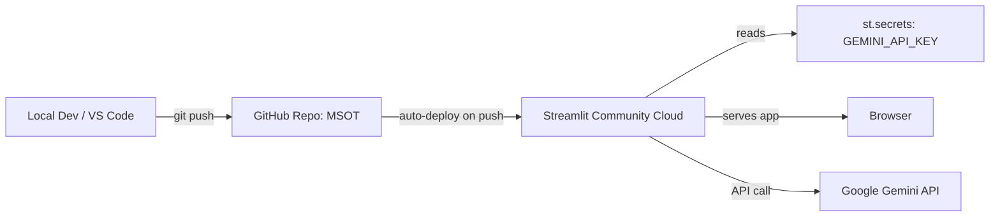

# System Architecture — The Expense Roaster

## 1. Overview
The Expense Roaster is a single-page Streamlit application that turns a
user's raw monthly transaction data into (a) a visual spending dashboard and
(b) an AI-generated, data-grounded financial roast + recovery plan via the
Gemini API.

## 2. Data Flow

## 3. Module Breakdown

| Module | Responsibility |
|---|---|
| **Data Ingestion** | `st.file_uploader` accepts a CSV with `Date, Category, Description, Amount` columns; validated and coerced with Pandas before entering state. |
| **State Management** | All mutable data (`expenses_df`, `roast_result`, `budget_goal`, `monthly_income`) lives in `st.session_state` so it survives Streamlit's rerun-on-interaction model. |
| **Aggregation Layer** | Pandas `groupby` computes category totals, Needs vs Wants split, and savings rate — pure functions, no side effects. |
| **Visualization Layer** | `st.metric` (KPI cards with deltas), `st.bar_chart`, `st.line_chart`, and `st.data_editor` render the aggregated data. |
| **Prompt Engineering Layer** | Builds a `system_instruction` (persona: "Roast-AI") plus a dynamic f-string user prompt that injects the *exact* rupee figures computed above — this is what makes the AI a tailored engine instead of a generic chatbot. |
| **AI Integration Layer** | Single batched call to `client.models.generate_content(model="gemini-2.5-flash", ...)`, wrapped in a form-gated button so it isn't re-triggered on every rerun (cost + latency control). |
| **Output Layer** | Markdown-rendered roast in the UI + a `st.download_button` exporting the plan as a `.md` file. |

## 4. API Integration Strategy

- **Model:** `gemini-2.5-flash` (Google GenAI SDK, `google-genai` package) — chosen
  for low latency and strong price-performance, appropriate for a
  request-response dashboard rather than a streaming chat.
- **Auth:** API key read from `st.secrets["GEMINI_API_KEY"]` (Streamlit Cloud),
  falling back to an environment variable, falling back to a sidebar text
  input for local/offline demos. The key is **never** hardcoded or committed.
- **Cost control:** The Gemini call only fires on an explicit button press
  inside a rerun boundary — not on every widget interaction — which is why
  the income/goal inputs are wrapped in `st.form`.
- **Grounding:** The prompt never lets the model "guess" numbers; every
  rupee figure quoted in the roast is computed by Pandas first and injected
  via f-string, so the response is always consistent with the dashboard.

## 5. Deployment Architecture

## 6. Future Extensions
- Multimodal input: snap a photo of a receipt (`st.camera_input`) and let
  Gemini Vision extract line items automatically.
- Voice recap: `st.audio_input` mic recorder for a spoken "roast me" trigger.
- Persistent storage (SQLite / Google Sheets) to track trends across months.
